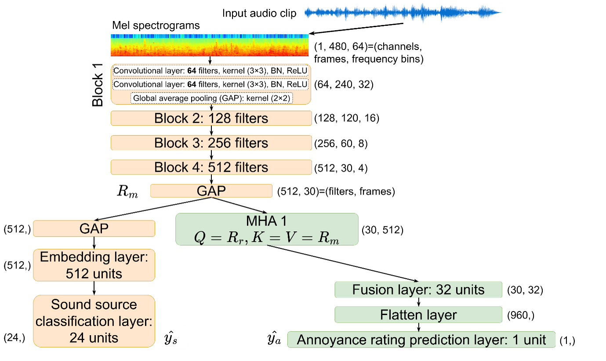
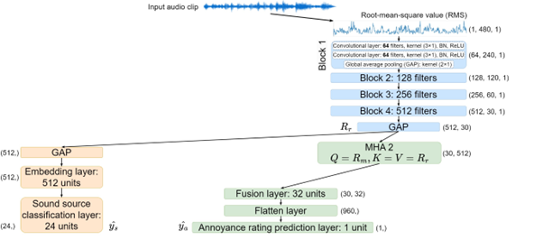
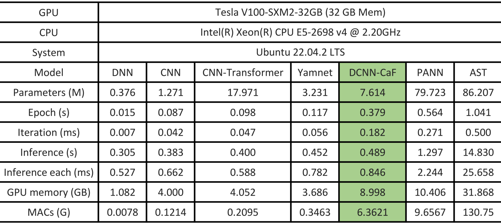

# AI-Based Soundscape Analysis: Jointly Identifying Sound Sources and Predicting Annoyance

<h3 align="center"> Figure 1: The DCNN-CaF model with only Mel features.</h3>
<div align="center">
 
</div>  

<h3 align="center"> Figure 2: The DCNN-CaF model with only RMS features.</h3>
<div align="center">
 
</div>  

# Citation
Please feel free to use the code and models, and consider citing our paper as
```bibtex
@article{10.1121/10.0022408,
    author = {Hou, Yuanbo and Ren, Qiaoqiao and Zhang, Huizhong and Mitchell, Andrew and Aletta, Francesco and Kang, Jian and Botteldooren, Dick},
    title = "{AI-based soundscape analysis: Jointly identifying sound sources and predicting annoyancea)}",
    journal = {The Journal of the Acoustical Society of America},
    volume = {154},
    number = {5},
    pages = {3145-3157},
    year = {2023},
    month = {11}, 
    issn = {0001-4966},
    doi = {10.1121/10.0022408},
    url = {https://doi.org/10.1121/10.0022408}, 
}
```

# Run models

```1) Unzip the Dataset under the application folder```

```2) Unzip the pretrained_models under the application folder```

```3) Enter the application folder: cd application```

## 1) Models for the joint ARP and SSC tasks

### 1.1) DCNN_CaF 
```python 
python inference_ARP_SSC.py -model DCNN_CaF
----------------------------------------------------------------------------------------
Parameters num: 7.614459 M
ARP:
        MAE: 0.8372967121097868, RMSE: 1.0516823194115195
SSC:
        AUC: 0.9006453415552284
```

### 1.2) DNN 
```python 
python inference_ARP_SSC.py -model DNN
----------------------------------------------------------------------------------------
Parameters num: 0.375769 M
ARP:
        MAE: 1.0421484866315518, RMSE: 1.3410438201986232
SSC:
        AUC: 0.8803192730739317
```

### 1.3) CNN 
```python 
python inference_ARP_SSC.py -model CNN
----------------------------------------------------------------------------------------
Parameters num: 1.270811 M
ARP:
        MAE: 0.9336034988862009, RMSE: 1.1964973202106266
SSC:
        AUC: 0.8791363928144383
```

### 1.4) CNN_Transformer 
```python 
python inference_ARP_SSC.py -model CNN_Transformer
----------------------------------------------------------------------------------------
Parameters num: 17.971227 M
ARP:
        MAE: 0.9509568487731644, RMSE: 1.1900119539356668
SSC:
        AUC: 0.8636173978248662
```

## 2) Models for the SSC task

### 2.1) DCNN_CaF_SSC 
```python 
python inference_SSC.py -model DCNN_CaF_SSC
----------------------------------------------------------------------------------------
Parameters num: 4.961112 M
SSC:
        AUC: 0.922593503235641
```

### 2.2) YAMNet 
```python 
python inference_ARP_SSC.py -model DNN
----------------------------------------------------------------------------------------
Parameters num: 3.231 M
SSC:
        AUC: 0.8727500810814068
```

### 2.3) PANN 
```python 
python inference_ARP_SSC.py -model CNN
----------------------------------------------------------------------------------------
Parameters num: 79.72284 M
SSC:
        AUC: 0.903805115943463
```

### 2.4) AST 
```python 
python inference_ARP_SSC.py -model CNN_Transformer
----------------------------------------------------------------------------------------
Parameters num: 86.207256 M
SSC:
        AUC: 0.8509725627182434
``` 

## 3) Computational overhead of models

<h3 align="center"> Table 1: Details of the parameters and computational overhead of models used and proposed in the paper.</h3>
<div align="center">
 
</div>  

# Visualization

Attention distributions of the cross-attention-based fusion module in the DCNN-CaF model. The 8 heads in the upper row come from MHA1, and the 8 heads in the lower row come from MHA2.


<h3 align="center"> Fig. 1: (a) Demo 1.</h3>
<div align="center">
 
</div>  

<h3 align="center"> Fig. 1: (b) Demo 2.</h3>
<div align="center">
 
</div>  

<h3 align="center"> Fig. 1: (c) Demo 3.</h3>
<div align="center">
 
</div>  

<h3 align="center"> Fig. 1: (d) Demo 4.</h3>
<div align="center">
 
</div>  

<h3 align="center"> Fig. 1: (e) Demo 5.</h3>
<div align="center">
 
</div>  
 
