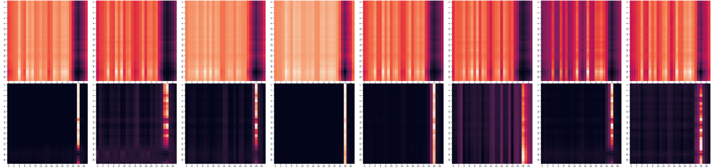
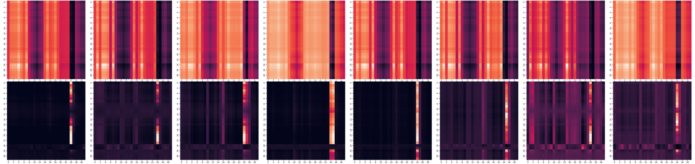
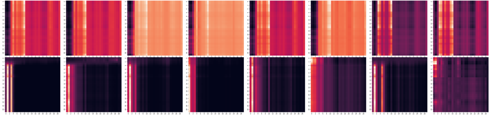
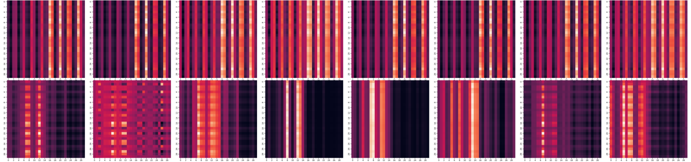
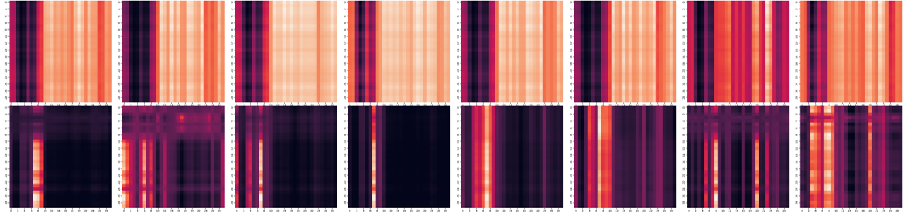

# AI-Based Soundscape Analysis: Jointly Identifying Sound Sources and Predicting Annoyance

Attention distributions of the cross-attention-based fusion module in the DCNN-CaF model. The 8 heads in the upper row come from MHA1, and the 8 heads in the lower row come from MHA2.

<h3 align="center"> Fig. 1: (a) Demo 1.</h3>

 

  

<h3 align="center"> Fig. 1: (b) Demo 2.</h3>

 

  

<h3 align="center"> Fig. 1: (c) Demo 3.</h3>

 

  

<h3 align="center"> Fig. 1: (d) Demo 4.</h3>

 

  

<h3 align="center"> Fig. 1: (e) Demo 5.</h3>

 

  
